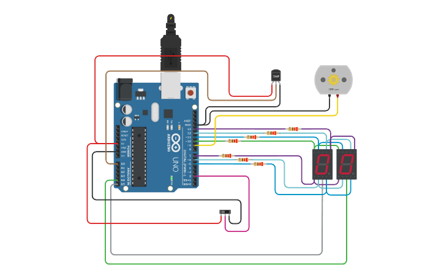

## Integrantes 
- Leon Gabriel Martinez Aquino - 1B

## Proyecto: Parte 2 Parcial Domiciliario SPD.

## Descripción
Contador del 0 al 99 que aumenta automaticamente con el tiempo, mostrandose con dos display 7 segmentos (utilizando la tecnica de multiplexacion) y segun la posicion del switch mostrar (solo numero primos o todos los numeros).

Ademas se utiliza un motor de corriente continua y sensor de temperatura analogico, el motor gira a una velocidad determinada con el siguiente calculo (valor del contador + temperatura medida por el sensor TMP + 31) y si los 2 valores "relativos" son max se puede alcanzan el max voltaje entregado por ArduinoUno "255" logrando que el motor gire a 5555 rpm.

Existe la siguiente condicion unica: si el switch indica que se muestren numeros del 0 al 99 y la temperatura medida por el sensor TMP es de -40, el motor se apaga.

## Función principal
Esta funcion aumenta el contador si la diferencia entre el tiempo guardado en "previoMillis" y "actualMillis", es igual o mayor al tiempo definido en la constante "INTERVALO". 

~~~ C (lenguaje en el que esta escrito)
void AumentarContador()
/*esta funcion sive para aumentar el contador segun el tiempo
indicado en el intervalo.*/
{
  unsigned long actualMillis = millis();
/*unsigned long ("se usa para definir que el numero no puede 
ser negativo").*/
  
  if (actualMillis - previoMillis >= intervalo)
/*
si la diferencia entre el tiempo actual y el previo
es mayor o igual al intervalo entonces aumento el contador
*/  
  {
   previoMillis = actualMillis;
//actualizo el tiempo previo
   contador += 1;
  }    
}
~~~

## :robot: Link al proyecto
- [proyecto](https://www.tinkercad.com/things/e1GW79EsyvE-p2-parcial-domiciliario-1b-leon-gabriel-martinez-aquino/editel?sharecode=T1NYO68wBXTzqwvMXw6FkoGEoI0u27wxiqBQMPOK10Y)

---
### Fuentes
- Distintos sitios web.
---
## Motor CC:

