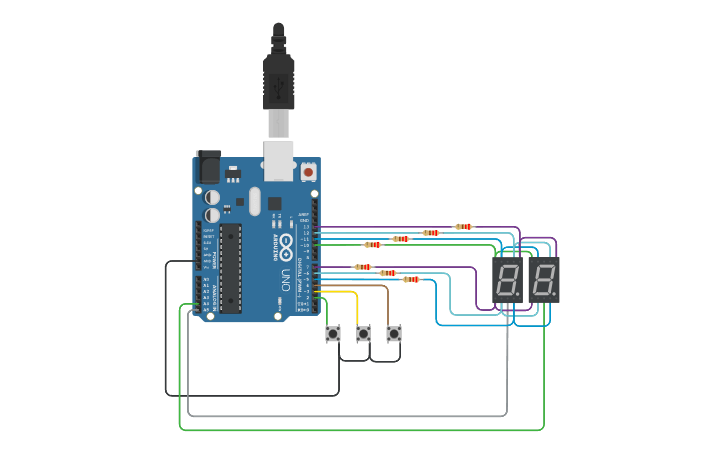

## Integrantes 
- Leon Gabriel Martinez Aquino - 1B

## Proyecto: Parte 1 Parcial Domiciliario SPD.

## Descripción
Contador del 0 al 99, utilizando dos display 7 segmentos, utilizando la tecnica de multiplexacion y controlando el 
numero del contador por medio de 3 botones (boton "sube" - boton "baja" - boton "reset").

## Función principal
Esta funcion realiza el efecto de "multiplexacion" y genera un bucle encargado
de calcular y mostrar el digito (decena o unidad) en el display correcto. 

Esta funcion a su vez utiliza a sus vez otras 2 funciones:

PrendeDigito: (que recibe 3 estados Unidad - Decenas o por defecto "cualquier otro valor") y a travez de los common 
de los 2 display, activa o desactiva el display indicado.

PrintDigit: que enciende los los correctos para formar el numero indicado.

~~~ C (lenguaje en el que esta escrito)
void PrintContador(int contador)
{
/*
Multiplexacion: es el efecto que se produce al alternar el encendido 
y apagado de los dos 7 segmentos muy rapido, esto produce el efecto 
visual de la activacion "simultanea"*/
  
  PrendeDigito(APAGADO);
//apagamos los display
  PrintDigit(contador / 10);
/*esta cuenta calcula que valor tiene la decena segun el valor del 
contador, y envia la señal del numero.*/
  PrendeDigito(DECENAS);
//encendemos las decenas y "recibimos el numero a imprimir".

  
  PrendeDigito(APAGADO);
//apagamos los display
  PrintDigit(contador - 10 * ((int)contador / 10));
/*esta cuenta calcula que valor tiene la unidad segun el valor del 
contador, y envia la señal del numero.*/
  PrendeDigito(UNIDAD);
//encendemos las unidad y "recibimos el numero a imprimir".
}
~~~

## :robot: Link al proyecto
- [proyecto]([https://www.tinkercad.com/things/aOYiibnDjWu](https://www.tinkercad.com/things/fjnY7L9EdeY-p1-parcial-domiciliario-1b-leon-gabriel-martinez-aquino/editel?sharecode=v86fY4R__D4DXNCbGvJF2T4yYxvQ_uRqjpWTVksz6jI)https://www.tinkercad.com/things/fjnY7L9EdeY-p1-parcial-domiciliario-1b-leon-gabriel-martinez-aquino/editel?sharecode=v86fY4R__D4DXNCbGvJF2T4yYxvQ_uRqjpWTVksz6jI](https://www.tinkercad.com/things/fjnY7L9EdeY-p1-parcial-domiciliario-1b-leon-gabriel-martinez-aquino/editel?sharecode=v86fY4R__D4DXNCbGvJF2T4yYxvQ_uRqjpWTVksz6jI)https://www.tinkercad.com/things/fjnY7L9EdeY-p1-parcial-domiciliario-1b-leon-gabriel-martinez-aquino/editel?sharecode=v86fY4R__D4DXNCbGvJF2T4yYxvQ_uRqjpWTVksz6jI)

---
### Fuentes
- [SPD clase 4](https://www.youtube.com/watch?v=_Ry7mtURGDE&list=PL7LaR6_A2-E11BQXtypHMgWrSR-XOCeyD&index=4&t=1087s).
---

